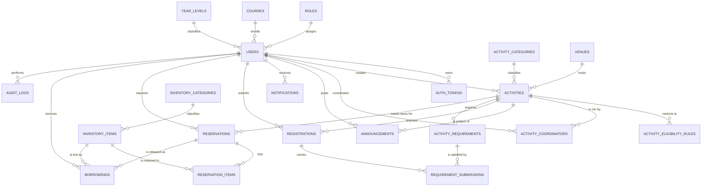

# CASMS — Database Design

**DBMS:** MySQL / MariaDB (XAMPP), InnoDB, `utf8mb4_unicode_ci`
**Script:** `database/schema.sql` — verified to execute cleanly; creates 22 tables, 3 views, and seed data.

---

## 1. Entity-Relationship Diagram



---

## 2. The Five-Entity Spine

Everything else in the system is a view, a report, or administration over these:

```
USER ──registers for──> ACTIVITY
  │                        │
  │                        └──defines──> REQUIREMENT
  └──submits──────────────────────────────────┘

INVENTORY_ITEM ──reserved in──> RESERVATION ──released as──> BORROWING
```

Build in that order. A registration is meaningless without an activity; a
requirement submission is meaningless without a registration.

---

## 3. Table Reference

### Module 1 — Accounts

| Table | Purpose | Key design note |
|-------|---------|-----------------|
| `roles` | student / staff / coordinator / admin | A lookup table, not an ENUM, so a new role needs no `ALTER TABLE` |
| `courses`, `year_levels` | Academic reference data | Separate tables so renaming a course does not rewrite student rows |
| `users` | All accounts, all roles | One table with nullable academic fields. Staff simply have `course_id = NULL` |
| `auth_tokens` | Remember-me and password reset | Stores a **SHA-256 hash** of the token — a leaked row cannot be replayed |

### Module 2 — Activities

| Table | Purpose | Key design note |
|-------|---------|-----------------|
| `activity_categories` | Culture / Arts / Sports / Intramurals | `color_hex` drives calendar coloring |
| `venues` | Physical locations | Separate table so conflict checking can query by venue |
| `activities` | Core event record | `start_at`/`end_at` as DATETIME power both calendar and conflict checks |
| `activity_eligibility_rules` | Year/course whitelist | **No rows = open to everyone.** Rows act as a whitelist, not a blacklist |
| `activity_coordinators` | Who runs it | Composite PK (`activity_id`,`user_id`) — many-to-many |

### Module 3 — Communication

| Table | Purpose | Key design note |
|-------|---------|-----------------|
| `announcements` | Office posts | Has a `FULLTEXT` index on (title, body) for keyword search |
| `notifications` | Per-user inbox | One row per user per event. `link_url` deep-links to what changed |

### Module 4 — Participation

| Table | Purpose | Key design note |
|-------|---------|-----------------|
| `registrations` | Student ↔ Activity join | `UNIQUE (activity_id, user_id)` is what makes double-registration **impossible**, not just discouraged |

### Module 5 — Requirements

| Table | Purpose | Key design note |
|-------|---------|-----------------|
| `activity_requirements` | What is asked for (defined once) | |
| `requirement_submissions` | What a student turned in | Linked to `registration_id`, not `user_id`, so a submission is always scoped to the right activity |

The "missing requirements" list is the **absence** of a row here — see view
`v_missing_requirements`. Nothing needs to be stored to know a student is behind.

### Module 6 — Inventory

| Table | Purpose | Key design note |
|-------|---------|-----------------|
| `inventory_categories` | Costume / Equipment / Props / AV | |
| `inventory_items` | The catalog | `quantity_total` = what the office owns |
| `reservations` | A request to hold items for a date range | |
| `reservation_items` | Line items of that request | Composite PK |
| `borrowings` | The physical hand-over log | Open loan = `returned_at IS NULL` |

**Critical rule:** quantity currently on loan is **never stored**. It is derived
by summing open borrowings (`v_item_availability`). A stored counter would
eventually drift out of sync with reality; a derived one cannot.

### Module 9 — Administration

| Table | Purpose | Key design note |
|-------|---------|-----------------|
| `audit_logs` | Who did what, when | Polymorphic: `entity_type` + `entity_id` covers every table with one log |
| `settings` | Key/value configuration | Lets the office change reminder lead time or report headers without editing PHP |

---

## 4. Views

Three views back the reporting screens so PHP never rebuilds these joins:

| View | Answers | Used by |
|------|---------|---------|
| `v_item_availability` | How many of each item are actually free right now? | Inventory catalog, availability check, inventory report (FR-6.3, FR-8.3) |
| `v_activity_participation` | Registered / approved / pending / attended per activity | Participation report, staff dashboard (FR-8.4) |
| `v_missing_requirements` | Which mandatory requirements has each student not satisfied? | Student checklist, staff follow-up list (FR-5.6, FR-5.7) |

---

## 5. Design Decisions Worth Defending

These are the answers to "why did you do it that way?" in a defense.

1. **One `users` table, not four.** Separate `students`/`staff` tables would
   duplicate every credential column and make `created_by` foreign keys
   ambiguous. Nullable academic columns cost far less than that duplication.

2. **`roles` as a table, not an ENUM.** The office may later add "Trainer" or
   "Team Captain". A lookup table makes that an `INSERT`, not a migration.

3. **Available quantity is derived, never stored.** See above — a stored counter
   drifts; a `SUM` of open borrowings cannot.

4. **Submissions attach to `registration_id`.** Attaching to `user_id` would
   lose track of which activity a document was submitted for, and would break
   as soon as a student joins two activities needing the same document type.

5. **Unique constraints over PHP checks.** `UNIQUE (activity_id, user_id)` on
   registrations holds even if two requests arrive at the same instant. A PHP
   `SELECT`-then-`INSERT` check does not.

6. **Polymorphic audit log.** One table logging all entities beats nine
   per-module log tables, and the admin needs one chronological view anyway.

7. **Status as ENUM, category as a table.** Statuses are fixed by business
   logic (code branches on them, so adding one requires code changes anyway).
   Categories are user-managed data. Different things, modeled differently.

---

## 6. Installation

```bash
# From the project root, with XAMPP MySQL running:
C:\xampp\mysql\bin\mysql.exe -u root < database/schema.sql
```

Creates the `casms` database and seeds roles, year levels, activity and
inventory categories, courses, venues, settings, and a default administrator:

| Field | Value |
|-------|-------|
| Email | `admin@buksu.edu.ph` |
| Password | `admin123` |

**Change this password on first login.** It is seeded only so the system is
reachable on a fresh install.

> Note: the script begins with `DROP DATABASE IF EXISTS casms;`. It is a clean
> installer, not a migration — do not run it against a database holding real data.
